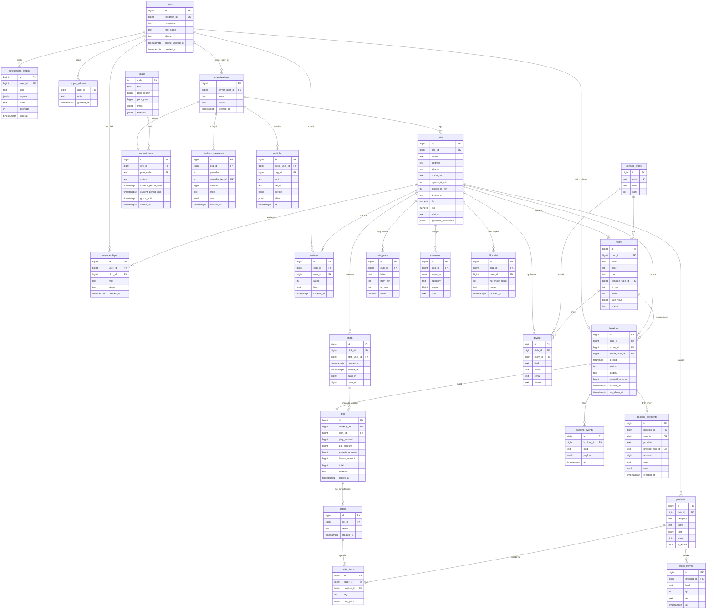

# PlayBron — Arxitektura taklifi

> Bosqich 0, 4-bo'lim. Qarorlar sabab bilan berilgan; tekshirilishi shart bo'lgan joylar
> `[TEKSHIRISH]` bilan belgilangan.

---

## 1. Multi-tenancy

### Variantlar

| Variant | Kuchli tomoni | Zaif tomoni |
|---|---|---|
| **A. Single schema + RLS** | Bitta migratsiya, cross-tenant hisobot oson, ulanish pooli sodda, backup yagona | Har bir tenant-scoped jadvalga policy yozish intizomi kerak; xato qilinsa oqish xavfi |
| B. Schema-per-tenant | Kuchli fizik izolyatsiya | Migratsiyani N marta yugurtirish, 100+ tenantda `pg_class` shishadi, cross-tenant so'rov og'ir, super admin paneli murakkab |
| C. Database-per-tenant | Eng kuchli izolyatsiya | Kichik SaaS uchun operatsion narxi asossiz |

### Tanlov: **A — single schema + PostgreSQL RLS**

Sabablari:
1. Super admin **cross-tenant agregat** ko'rishi kerak (platforma tushumi, klublar tushumi
   jamlanmasi) — B/C da bu N ta ulanish yoki ETL talab qiladi.
2. Mijoz **global** — u tenantga tegishli emas, lekin bronlari tenant ichida. Bitta sxemada
   bu tabiiy `client_user_id` FK; schema-per-tenant da mijoz jadvali dublikat bo'ladi.
3. Klublar soni yuzlab bo'ladi, minglab emas — RLS ning narxi maqbul.

### Amalga oshirish qoidalari

- Har bir tenant-scoped jadvalda **`club_id`** (yoki `org_id`) ustuni majburiy.
- Har bir shunday jadval yaratilgan **o'sha migratsiyada**: `ENABLE ROW LEVEL SECURITY`,
  `FORCE ROW LEVEL SECURITY`, `tenant_isolation` policy.
- Ilova `playbron_app` roli bilan ulanadi (RLS unga tegishli). Migratsiya va seed —
  egasi roli bilan (`DIRECT_URL`), chunki superuser RLS ni chetlab o'tadi.
- Kontekst har so'rov boshida: `SET LOCAL app.club_id = ...`, `SET LOCAL app.user_id = ...`.
  Python tomonda bu **middleware + `contextvars`** orqali (Node'dagi `nestjs-cls` o'rniga).
- Qo'lda `WHERE club_id = ...` yozib RLS ni chetlab o'tish taqiqlanadi — policy yagona manba.

### Global (tenantsiz) jadvallar

`users`, `console_types`, `plans`, `platform_payments`, `audit_log`, `super_admins`,
`notifications_outbox` (user bo'yicha), `client_blocklist_global` — bularga RLS qo'llanmaydi
yoki boshqacha policy (o'z yozuvi) qo'llanadi.

---

## 2. Identity va auth

### Model

**Bitta `users` jadvali, yagona kalit `telegram_id` (bigint, unique).** Parol yo'q, email yo'q.
Rol foydalanuvchida emas — **`memberships`** jadvalida (`user_id` × `club_id` × `role`).

### Ikki kirish nuqtasi, bitta servis

```
Landing (brauzer)          Mini App (Telegram)
Telegram Login Widget      window.Telegram.WebApp.initData
        │                          │
        ▼                          ▼
POST /auth/telegram/widget   POST /auth/telegram/initdata
        │                          │
        └────────► AuthService.verify() ◄────────┘
                          │
                 users upsert (telegram_id)
                          │
                 memberships o'qish → rol
                          │
                 access + refresh token
```

`AuthService.verify()` ikkala kirish uchun **bitta natija** qaytaradi:
`{ user, memberships[], is_super_admin }`. Farq faqat imzo tekshirishda.

### Imzo tekshirish

| Kanal | Nima tekshiriladi |
|---|---|
| Login Widget | Maydonlardan `data_check_string` yig'iladi, kalit — bot tokenidan olinadi, HMAC-SHA256 solishtiriladi, `auth_date` eskirmaganligi |
| Mini App `initData` | `initData` query-string sifatida ajratiladi, `hash` chetga olinadi, qolgani alifbo tartibida `data_check_string` ga yig'iladi, kalit `WebAppData` konstantasi bilan hosil qilinadi, HMAC-SHA256, `auth_date` TTL |

> `[TEKSHIRISH]` Ikki kanalda **kalit hosil qilish tartibi har xil** — Widget va WebApp uchun
> HMAC kaliti bir xil emas. Aniq formulalar (qaysi biri `HMAC(bot_token, "WebAppData")`,
> qaysi biri `SHA256(bot_token)`) rasmiy hujjatdan olinadi:
> Telegram Bot API → *Login Widget: Checking authorization* va
> *Mini Apps: Validating data received via the Mini App*. Xotiradan yozilmaydi.

### TTL va replay himoyasi

- `auth_date` TTL: **Mini App uchun 5 daqiqa**, Login Widget uchun **24 soat**
  (widget cookie'da uzoq yashaydi). Qiymatlar konfiguratsiyada.
- **Replay:** ishlatilgan `hash` Redis'ga `SETEX auth:used:{hash} <ttl>` bilan yoziladi;
  ikkinchi marta kelsa rad etiladi.
- Barcha tekshirish **doimiy vaqtli solishtirish** bilan (`hmac.compare_digest`).
- `initData` hech qachon log'ga yozilmaydi.

### Sessiya strategiyasi

| Element | Qaror |
|---|---|
| Access token | JWT, **15 daqiqa**, `sub=user_id`, `mbr=[{club_id, role}]`, `sa=bool`, `jti` |
| Refresh token | Opaque, DB'da hash holida, **30 kun**, rotatsiya bilan (har ishlatilganda yangisi) |
| Saqlash — Mini App | `sessionStorage`; ilova qayta ochilganda `initData` bilan jimgina qayta olinadi (Telegram har ochilishda yangi `initData` beradi) |
| Saqlash — brauzer kabinet | `httpOnly` + `Secure` + `SameSite=Lax` cookie; CSRF uchun double-submit token |
| Konsol sessiyasi | Hozirgi mock 24 soat. **Saqlanadi**: refresh 24 soatdan keyin so'nadi va Telegram qayta tasdiqlashni so'raydi — mavjud UI ning «sessiya 24 soat» va'dasi buzilmaydi |
| Rol o'zgarsa | `memberships` o'zgarganda o'sha foydalanuvchining refresh tokenlari bekor qilinadi |

### Telefon raqami — `requestContact`

`initData` telefonni **bermaydi**. Oqim:

```
Mini App → telefon kerak bo'lgan nuqta
   → "Telefonni tasdiqlash" tugmasi
   → botga deep-link (t.me/<bot>?start=phone_<nonce>)
   → bot ReplyKeyboardMarkup + request_contact yuboradi
   → foydalanuvchi bosadi → bot `contact` xabarini oladi
   → backend: users.phone = contact.phone_number, phone_verified_at = now
      (faqat contact.user_id == message.from.id bo'lsa — begona kontakt qabul qilinmaydi)
   → Mini App poll yoki WebSocket orqali holatni yangilaydi
```

**Telefon qachon majburiy:**

| Nuqta | Telefon |
|---|---|
| Mini App'ga kirish, klublarni ko'rish | Kerak emas |
| **Birinchi bron yaratish** | **Majburiy** — klub mijozga qo'ng'iroq qila olishi kerak |
| Xodim sifatida konsolga kirish | Majburiy |
| Klub egasi — tarif sotib olish | Majburiy (to'lov va hisob-faktura uchun) |

Hozirgi `register.tsx` telefonni qo'lda so'raydi — u `requestContact` ga almashadi
(`design-change-requests.md` da).

---

## 3. Rol modeli

### Rollar

| Rol | Ko'lami | Qanday paydo bo'ladi |
|---|---|---|
| `SUPER_ADMIN` | Global | **Faqat seed.** `telegram_id` oldindan `super_admins` jadvaliga yoziladi. Ro'yxatdan o'tish yo'li yo'q |
| `OWNER` | Tashkilot (`org_id`) | Landing'da Telegram bilan kiradi va tarif sotib oladi |
| `ADMIN` | Klub | Egasi tayinlaydi — egadan farqi: to'lov va obunaga tegmaydi |
| `STAFF` | Klub | Egasi/admin taklif qiladi |
| `CLIENT` | **Global** | Mini App'da o'zi ro'yxatdan o'tadi |

`CLIENT` — `memberships` da yozuv **emas**. Har bir foydalanuvchi sukut bo'yicha mijoz;
membership bo'lsa — qo'shimcha rol oladi. Shu sababli bitta `telegram_id`:

- A klubda `STAFF`,
- B klubda `ADMIN`,
- C klubda oddiy mijoz bo'lib bron qila oladi.

**Kontekst almashtirish:** access token ichida `memberships[]` bo'ladi; Mini App ochilganda
agar membership bo'lsa «Xodim rejimi / Mijoz rejimi» tanlovi ko'rsatiladi, aks holda
to'g'ridan-to'g'ri mijoz yuzasi.

### Ruxsatlar matritsasi

`—` yo'q · `R` o'qish · `W` yozish · `A` to'liq (o'chirish ham) · `∑` faqat agregat

| Resurs | SUPER_ADMIN | OWNER | ADMIN | STAFF | CLIENT |
|---|---|---|---|---|---|
| Tashkilotlar (barchasi) | A | — | — | — | — |
| O'z tashkiloti | R | A | R | — | — |
| Obuna / tarif | A | A | R | — | — |
| Platforma to'lovlari | A | R (o'ziniki) | — | — | — |
| Klub profili, cover | R | A | W | R | R (public) |
| Xonalar, tariflar, qurilmalar | R | A | A | R | R (public) |
| Xodimlar va rollar | R | A | W (STAFF gacha) | — | — |
| Mahsulot katalogi | R | A | A | R | R (menyu) |
| Kirim / inventarizatsiya | R | A | A | W | — |
| Xarajatlar | ∑ | A | A | — | — |
| Bronlar | ∑ | R | W | A | A (o'zinikiga) |
| Kassa / hisob yopish | ∑ | R | W | A | R (o'zinikiga) |
| Smena | R | R | W | A | — |
| Qora ro'yxat | R | A | A | W | — |
| Hisobotlar (klub) | ∑ | R | R | — | — |
| Audit log | A | R (o'z tashkiloti) | — | — | — |
| AI Agent sozlamasi | R | A (Infinite) | — | — | — |
| Sharh yozish | — | — | — | — | W |

Ruxsat **backendda** tekshiriladi (policy qatlami + RLS). Frontend faqat tugmani yashiradi.

---

## 4. Kabinet qayerda yashaydi

### Klub egasi kabineti

| Variant | Kuchli | Zaif |
|---|---|---|
| **Brauzerdagi web kabinet** | Katta ekran — jadval, hisobot, grafik uchun zarur; to'lov redirect'i tabiiy; chop etish/eksport; hozirgi `apps/admin` shunga qurilgan | Har safar Telegram Login Widget orqali kirish |
| Mini App ichida | Bitta kirish nuqtasi, push tabiiy | Telegram WebView'da to'lov redirect'i og'riqli; katta jadvallar noqulay; ekran maydoni kichik |

**Tavsiya: brauzerdagi web kabinet** (mavjud `apps/admin`), Telegram Login Widget bilan.
Qo'shimcha: Telegram botda «Kabinetni ochish» tugmasi — bir bosishda brauzerda ochadi.
Mini App ichida egaga faqat **qisqa xulosa** (bugungi tushum, bandlik) ko'rsatiladi —
alohida ekran emas, AI Agent xabari shu vazifani bajaradi.

### Xodim

**Mini App** (talab shunday). Lekin hozirgi `apps/admin` konsoli — brauzer uchun.
Ikki yo'l:

1. `apps/admin` ni Mini App sifatida ham ochish (mobil moslashuv allaqachon bor, 390px da
   tekshirilgan) — **tavsiya etiladi**, chunki qo'shimcha kod bazasi tug'ilmaydi;
2. `docs/designs/PlayBron Xodim Mobil.dc.html` bo'yicha alohida yuza qurish — dizayn manbai
   bor, lekin ikkinchi ilova = ikki barobar ish.

Qaror: **1-variant**, `Xodim Mobil` prototipi keyingi fazada ixtiyoriy yaxshilanish sifatida.

### Super admin paneli

**Brauzerda, alohida marshrut** (`apps/admin` ichida `/platform/*` yoki alohida app).
Sabab: cross-tenant ma'lumot, audit, xavfli amallar (tenant to'xtatish) — Telegram
WebView'da bunday panelni ochish xavf va noqulaylik.

**Tavsiya:** `apps/admin` ichida alohida rol-marshrut. Sabab — DS, shell, jadval
komponentlari tayyor; alohida app faqat dublikat beradi.

---

## 5. Ma'lumotlar bazasi

### ER sxema



### Bron to'qnashuvi — DB darajasida

`bookings.period` **`tstzrange`** turi bo'ladi (`starts_at`/`ends_at` alohida emas). Keyin:

```sql
CREATE EXTENSION IF NOT EXISTS btree_gist;

ALTER TABLE bookings ADD CONSTRAINT bookings_no_overlap
  EXCLUDE USING gist (
    room_id WITH =,
    period  WITH &&
  ) WHERE (status IN ('reserved', 'active'));
```

- `btree_gist` — `room_id` (skalyar) va `period` (diapazon) ni bitta indeksda birlashtiradi.
- `WHERE` — bekor qilingan va tugagan bronlar to'qnashuvni bloklamaydi.
- Konflikt SQLSTATE **`23P01`** beradi → API `409 SLOT_TAKEN` qaytaradi.
- Ilova darajasida «avval tekshir, keyin yoz» **qilinmaydi** — u poyga holatiga ochiq.

Grace va uzaytirish: uzaytirish `period` ning yuqori chegarasini o'zgartiradi; agar keyingi
bron bilan kesishsa xuddi shu konstreynt bloklaydi va UI «keyingi bron bor» deb ko'rsatadi.

### Indekslar

| Jadval | Indeks | Nima uchun |
|---|---|---|
| `users` | `UNIQUE (telegram_id)` | Auth |
| `memberships` | `UNIQUE (user_id, club_id)`, `INDEX (club_id, role)` | Rol tekshirish, xodimlar ro'yxati |
| `bookings` | `EXCLUDE (room_id, period)`, `INDEX (club_id, lower(period))`, `INDEX (client_user_id, lower(period) DESC)` | Board, timeline, «Bronlarim» |
| `bills` | `INDEX (club_id, closed_at DESC)`, `INDEX (shift_id)` | Kassa, smena, hisobot |
| `order_items` | `INDEX (product_id)` | Reestr |
| `stock_moves` | `INDEX (product_id, at DESC)` | Qoldiq hisobi |
| `expenses` | `INDEX (club_id, spent_on DESC)` | Xarajat hisoboti |
| `platform_payments` | `UNIQUE (provider, provider_txn_id)` | Idempotentlik |
| `booking_payments` | `UNIQUE (provider, provider_txn_id)`, `INDEX (club_id, created_at DESC)` | Idempotentlik, klub tushumi hisoboti |
| `subscriptions` | `INDEX (status, current_period_end)` | Muddat tekshiruvchi job |
| `notifications_outbox` | `INDEX (state, created_at)` | Yuboruvchi job |

### Pul va vaqt

- Pul — **`bigint`, so'm, kasrsiz**. JSON javobda **satr** sifatida (JS `Number` xavfi).
- Vaqt — DB'da `timestamptz` (UTC). Ko'rsatishda klub `timezone` (odatda `Asia/Tashkent`).
- Klub ish vaqti daqiqada (`opens_at_min`, `closes_at_min` — 26:00 = 1560 kabi).

---

## 6. To'lov — Click va Payme

> Bu bo'lim **integratsiya konturi**. Aniq metod nomlari, imzo formulalari va maydon
> nomlari **rasmiy hujjatdan** olinadi — quyida nima tekshirilishi kerakligi belgilangan.

### 6.0 Ikkita to'lov yuzasi — aralashmaydi

Tizimda Click/Payme **ikki xil maqsadda** ishlatiladi. Bu ikkalasi alohida jadval, alohida
holat mashinasi va alohida hisobotga tushadi.

| | **Obuna to'lovi** | **Bron to'lovi** |
|---|---|---|
| Kim to'laydi | Klub egasi | Mijoz |
| Kimga | **Platformaga** | **Klubga** |
| Nima uchun | Gold / Platinium / Infinite tarifi | Bronni tasdiqlash — 1 soatlik summa |
| Jadval | `platform_payments` | `booking_payments` |
| Qayerdan boshlanadi | Kabinet (brauzer) | Mini App (Telegram) |
| Hisobotda | Platforma tushumi (a) — super admin | Klub tushumi (b) — klub egasi |
| Qaytarish | Super admin | Klub (no-show'da qaytarilmaydi — jarima) |

**Hal qilinishi kerak bo'lgan biznes savoli** (Faza 5 boshlanishidan oldin):
bron pullari **kimning merchant hisobiga** tushadi?

| Variant | Kuchli | Zaif |
|---|---|---|
| **A. Har klub o'z merchant hisobi** | Pul to'g'ridan-to'g'ri klubga, platforma pul saqlamaydi, soliq/huquq sodda | Har bir klub Click/Payme'da o'zi ro'yxatdan o'tishi kerak; onboarding uzayadi; kalitlar bizda shifrlangan holda saqlanadi |
| B. Platforma yig'adi, keyin klubga o'tkazadi | Onboarding oson, bitta integratsiya | Platforma **pul saqlovchi** bo'lib qoladi — litsenziya, hisob-kitob, qaytarish javobgarligi bizda |

**Tavsiya: A.** Klub o'z merchant kalitlarini kabinetga kiritadi
(`clubs.payment_credentials`, shifrlangan). Platforma faqat marshrutlaydi va
tranzaksiyani yozadi. Obuna to'lovi esa **platformaning o'z merchant hisobiga** boradi.

> `[TEKSHIRISH]` Click va Payme'da bir ilova ostida **ko'p merchant** (marketplace/
> sub-merchant) rejimi bormi — rasmiy hujjatdan aniqlanadi. Yo'q bo'lsa, har klub
> o'z `service_id`/`merchant_id` sini kiritadi va biz uni so'rovda uzatamiz.

> **HOLAT (2026-08-14):** biznes tomonidan hali tanlanmagan. Variant A tavsiya
> bo'lib qolmoqda, lekin qaror qabul qilinmaguncha kod yozilmaydi va bu haqda
> tashqi materiallarda (landing, taklif) da'vo qilinmaydi.

### Bekor qilish siyosati — hal qilinmagan

Bron **bekor qilinganda** 1 soatlik oldindan to'lov qaytariladimi? No-show holati
aniq (qaytarilmaydi — jarima), lekin mijoz **o'zi oldindan bekor qilsa** qoida yo'q.

| Savol | Nima hal qilinishi kerak |
|---|---|
| Chegara vaqti | Necha soat oldin bekor qilinsa pul qaytadi (masalan 3 soat)? |
| Qisman qaytarish | To'liq qaytariladimi yoki ushlab qolinadigan ulush bormi? |
| Qayerga qaytadi | Provayder orqali kartaga yoki mijozning klubdagi hisobiga? |
| Klub o'zi bekor qilsa | To'liq qaytarish + mijozga uzr xabari (bu tomon aniq) |
| Kim boshqaradi | Chegara klub sozlamasi bo'ladimi yoki platforma bo'ylab yagona? |

Bu qoida `bookings` holat mashinasiga va `booking_payments` refund oqimiga
bevosita ta'sir qiladi — **Faza 5 boshlanishidan oldin** javob kerak.

> **HOLAT (2026-08-14):** hal qilinmagan. Landing va boshqa tashqi materiallarda
> bekor qilish shartlari haqida hech narsa va'da qilinmaydi.

### Umumiy oqim (obuna)

```
Kabinet (brauzer) → tarif tanlash → POST /api/v1/checkout
   → backend: platform_payments (state=created), invoice yaratadi
   → provayder to'lov sahifasiga redirect (URL backend yasaydi)
   → foydalanuvchi to'laydi
   → (a) provayder → backend webhook  [ishonchli manba]
   → (b) foydalanuvchi → return_url    [faqat UI uchun]
   → webhook: to'lov tasdiqlansa subscription active bo'ladi
   → botga xabar: "Tarif faollashdi"
```

**Muhim:** obuna faqat **webhook** bo'yicha faollashadi. `return_url` — ko'rinish uchun;
u kelmasligi yoki soxta bo'lishi mumkin.

### Backendda yozilishi kerak bo'lgan endpointlar

| Endpoint | Kim chaqiradi | Vazifasi |
|---|---|---|
| `POST /api/v1/checkout` | Kabinet | Tarif + davr + provayder → to'lov havolasi |
| `POST /api/v1/payments/click/prepare` | Click | Birinchi bosqich — to'lovni tayyorlash |
| `POST /api/v1/payments/click/complete` | Click | Ikkinchi bosqich — yakunlash |
| `POST /api/v1/payments/payme` | Payme | Yagona JSON-RPC endpoint (bir necha metod bitta manzilda) |
| `GET /api/v1/payments/{id}` | Kabinet | Holatni so'rash (return sahifasi poll qiladi) |
| `POST /api/v1/payments/{id}/refund` | Super admin | Obuna to'lovini qaytarish |
| `POST /api/v1/bookings/{id}/pay` | Mini App | Bron to'lovi — klub merchant hisobiga havola |
| `POST /api/v1/payments/booking/{provider}` | Click / Payme | Bron to'lovi callback'i (obunadan alohida marshrut) |
| `POST /api/v1/bookings/{id}/refund` | Klub admini | Bron to'lovini qaytarish (bekor qilishda) |

> `[TEKSHIRISH]` **Click**: ikki bosqichli protokol (`Prepare` / `Complete`) va imzo
> (`sign_string` tarkibi: `click_trans_id`, `service_id`, `SECRET_KEY`, `merchant_trans_id`,
> `amount`, `action`, `sign_time` — tartib va MD5/boshqa xesh) rasmiy Click Merchant API
> hujjatidan tasdiqlanadi. Xato kodlari (`error`, `error_note`) ham u yerdan.
>
> `[TEKSHIRISH]` **Payme**: Merchant API JSON-RPC metodlari
> (`CheckPerformTransaction`, `CreateTransaction`, `PerformTransaction`,
> `CancelTransaction`, `CheckTransaction`, `GetStatement`), autorizatsiya
> (`Authorization: Basic` — login `Paycom`, parol — kalit), xato kodlari (`-31001` va
> boshqalar) rasmiy hujjatdan.
>
> `[TEKSHIRISH]` **Summa birligi**: Payme odatda **tiyin** bilan ishlaydi, Click — boshqacha
> bo'lishi mumkin. Bizda ichki pul birligi — **so'm (bigint)**. Har bir provayder uchun
> konvertatsiya koeffitsiyenti hujjatdan tasdiqlanadi va **bitta joyda**
> (`payments/providers/<name>/money.py`) saqlanadi.

### Tranzaksiya holat mashinasi

```
created ──► pending ──► paid ──► (refunded)
   │           │
   │           ├──► cancelled   (foydalanuvchi bekor qildi)
   └───────────┴──► failed      (provayder rad etdi / timeout)
```

Qoidalar:
- `paid` — **terminal**, faqat `refunded` ga o'tadi.
- `failed` dan `paid` ga o'tish taqiqlanadi (yangi to'lov yozuvi yaratiladi).
- Har o'tish `platform_payments` da `raw` (provayder javobi) bilan yoziladi.

### Idempotentlik

- `UNIQUE (provider, provider_txn_id)` — takroriy webhook yangi yozuv yaratmaydi.
- Webhook ishlovchisi **`SELECT … FOR UPDATE`** bilan yozuvni bloklaydi va holatni
  qayta hisoblaydi; bir xil natija qaytaradi (provayder qayta yuborishi normal).
- `checkout` da `Idempotency-Key` sarlavhasi qo'llab-quvvatlanadi.

### Webhook xavfsizligi

| Chora | Tafsilot |
|---|---|
| Imzo | Har bir so'rov imzosi tekshiriladi (formulalar — yuqoridagi `[TEKSHIRISH]`) |
| IP allowlist | Provayder IP diapazoni (hujjatdan) — reverse proxy darajasida |
| HTTPS majburiy | TLS yo'q bo'lsa rad |
| Tashqi ta'sirsiz | Webhook faqat DB yozadi va outbox'ga xabar qo'yadi; og'ir ish job'ga o'tadi |
| Log | To'liq `raw` saqlanadi, lekin maxfiy kalitlar maskalanadi |
| Javob vaqti | Provayderlar qat'iy timeout qo'yadi — ishlovchi 1–2 soniyada javob berishi kerak |

### Muvaffaqiyatsiz to'lov va qaytarish

| Stsenariy | Xatti-harakat |
|---|---|
| To'lov rad etildi | `failed`; obuna holati o'zgarmaydi; kabinetda «qayta urinish» |
| To'lov yarim qoldi (prepare bor, complete yo'q) | 30 daqiqadan keyin job `expired` qiladi |
| Ikki marta to'landi | Ikkinchisi idempotentlik bilan aniqlanadi; agar haqiqatan ikki tranzaksiya bo'lsa — super admin qo'lda qaytaradi |
| Qaytarish | Faqat super admin; obuna `cancelled` ga o'tadi, `audit_log` ga yoziladi |

### Telegramdan tashqarida to'lash va qaytish

Kabinet **brauzerda** bo'lgani uchun redirect tabiiy. Agar to'lov Mini App'dan
boshlansa:

1. `Telegram.WebApp.openLink(url)` — tashqi brauzerda ochiladi;
2. Mini App «To'lov kutilmoqda» ekranida qoladi va `GET /payments/{id}` ni poll qiladi;
3. Webhook kelgach holat `paid` bo'ladi → ekran o'zi yangilanadi;
4. Bir vaqtda bot ham xabar yuboradi — foydalanuvchi Mini App'ni yopgan bo'lsa ham biladi.

`return_url` → statik sahifa: «To'lov qabul qilindi, Telegramga qayting» + deep-link.

---

## 7. Obuna

> **Sinov davri yo'q** (biznes qarori). Tashkilot birinchi to'lovgacha `pending` holatda
> yashaydi — kabinet ochiladi, lekin faqat checkout ko'rinadi.

### Holat mashinasi

```
pending ──► active ──► past_due ──► grace ──► suspended ──► cancelled
              ▲           │           │           │
              └───────────┴───────────┴───────────┘
                    (to'lov keldi → active)
```

| Holat | Ma'nosi | Muddat | Ilova nima qiladi |
|---|---|---|---|
| `pending` | Tashkilot yaratilgan, hali to'lov yo'q | — | Faqat checkout ekrani |
| `active` | To'langan | Davr oxirigacha | To'liq ishlaydi |
| `past_due` | Muddat tugadi, to'lov kelmadi | **0–3 kun** | Ishlaydi + bloklovchi banner, har kirishda eslatma |
| `grace` | Imtiyozli muddat | **3 kun** (`GRACE_DAYS`, konfiguratsiyada) | Ishlaydi, ogohlantirish kuchayadi, kunlik Telegram eslatma |
| `suspended` | To'xtatilgan | to'lovgacha | **Yozish bloklanadi**, o'qish qoladi; klub mijoz Mini App'idan chiqadi, mavjud bronlar bekor qilinmaydi |
| `cancelled` | Bekor qilingan | — | Faqat eksport va to'lovlar tarixi |

**Grace nima uchun kerak:** to'lov kechikishi ko'pincha texnik (karta muddati, provayder
uzilishi). Klubni darhol bloklash mijozlarning bronini buzadi — 3 kun ichida egasi
to'lashga ulguradi va hech kim zarar ko'rmaydi. `GRACE_DAYS` env'da o'zgaradi.

### Kim va qachon tekshiradi

- **Kunlik scheduler** (soat 03:00 UTC): `current_period_end` o'tganlarni
  `active → past_due`, `past_due → grace`, `grace + GRACE_DAYS → suspended`.
- **Har so'rovda** — o'qish arzon: access token ichida `sub_status` va `sub_exp` bo'ladi
  (15 daqiqa eskirishi maqbul). Yozish amallarida DB'dan qayta tekshiriladi.
### Eslatmalar

| Qachon | Kanal | Ko'rinishi |
|---|---|---|
| **Tugashiga 3 kun qolganda** | Telegram (admin bot) **+ dashboard alert** | Egaga xabar; kabinetda «Boshqaruv paneli» tepasida `StatusLine tone="warn"` — «Tarif muddati 3 kundan keyin tugaydi · Uzaytirish» |
| Tugagan kuni | Telegram + dashboard | `tone="danger"`, bloklovchi banner |
| Grace davomida | Har kuni Telegram + dashboard | Qolgan kun soni ko'rsatiladi |
| `suspended` bo'lganda | Telegram | «Klub to'xtatildi, to'lov kutilmoqda» |

Dashboard alert `GET /me/subscription` javobidagi `days_left` va `status` dan chiqadi —
yangi vizual element emas, mavjud `StatusLine` komponenti.

> `GRACE_DAYS` sukut bo'yicha **3 kun** (env'da). Tasdiqlanmagan — biznes tomonidan
> aniqlanishi kerak: muddat tugagach klub darhol bloklanadimi yoki bir necha kun ishlaydimi.

### Tarif o'zgartirish

| Yo'nalish | Qoida |
|---|---|
| **Upgrade** | Darhol kuchga kiradi. Qolgan kunlar proratsiya bilan hisoblanadi va yangi davrga qo'shiladi. Limitlar darhol kengayadi |
| **Downgrade** | **Joriy davr oxirida** kuchga kiradi. Sabab: limitdan oshib ketgan resurslar (masalan 12 xona, yangi tarifda 8) bilan nima qilish muammosi |
| Downgrade'da limitdan oshgan resurs | O'chirilmaydi — **muzlatiladi**: mavjudi ishlaydi, yangisini qo'shib bo'lmaydi. Kabinetda «tarif limitidan oshgan» ro'yxati ko'rsatiladi |

---

## 8. Tarif entitlement tizimi

- **Manba:** `plans.limits` va `plans.features` (jsonb) — DB'da, migratsiya bilan seed.
  Kod ichida qotirilmaydi (super admin qo'lda tarif bera olishi kerak).
- **Tekshirish joyi:** backendda **majburiy** — har bir yozish endpointida
  `require_feature("ai_agent")` / `check_limit("rooms", club_id)` dekoratori.
- **Frontend:** `GET /me/entitlements` javobini olib faqat tugmani yashiradi yoki
  «tarifni ko'tarish» holatini ko'rsatadi. Hech qachon yagona to'siq bo'lmaydi.
- **Kesh:** entitlement access token ichiga qo'yiladi (15 daqiqa) + Redis'da `org:{id}:ent`.
  Tarif o'zgarganda kesh bekor qilinadi va tokenlar rotatsiya qilinadi.

Batafsil matritsa — `03-entitlements.md`.

---

## 9. Super admin qatlami

### Cross-tenant o'qish va RLS

RLS ni chetlab o'tishning **uch yo'li** bor; tanlov:

| Yo'l | Baho |
|---|---|
| `BYPASSRLS` atributli alohida DB roli | **Tanlanadi.** `playbron_platform` roli — faqat platforma endpointlari shu ulanish poolidan foydalanadi |
| Policy ichida `app.is_super_admin` bayrog'i | Har bir policy murakkablashadi, xato qilish oson |
| Superuser bilan ulanish | Qat'iy taqiq |

Qoidalar:
- **Ikki alohida ulanish pooli**: `playbron_app` (RLS bilan) va `playbron_platform`
  (`BYPASSRLS`, faqat o'qish uchun `SELECT` grant).
- Platforma poolidan **yozish faqat** `organizations.status`, `subscriptions`, `audit_log` ga
  ruxsat etiladi — klub ma'lumotiga super admin yozmaydi.
- Har bir platforma so'rovi `audit_log` ga yoziladi (o'qish ham).

### Super adminni himoya qilish

| Chora | Tafsilot |
|---|---|
| Seed | `super_admins` jadvaliga `telegram_id` migratsiya orqali kiritiladi. UI'da qo'shish yo'q |
| Allowlist | Auth vaqtida `telegram_id` shu jadvalda yo'q bo'lsa — platforma endpointlari 404 (403 emas: panel borligi bilinmasin) |
| IP cheklovi | `/api/v1/platform/*` — reverse proxy darajasida IP allowlist (ixtiyoriy, konfiguratsiyada) |
| Har kirish log'i | `audit_log`: kim, qachon, qaysi IP, qaysi User-Agent |
| Ikkinchi omil | Xavfli amallar (tenant to'xtatish, qaytarish) — botga tasdiq kodi yuboriladi |
| Sessiya | Qisqaroq: access 10 daqiqa, refresh 8 soat |

### Super admin ko'radigan metrikalar

**Platforma tushumi (a):**
MRR / ARR, yangi obunalar, uzaytirishlar, churn (bekor qilingan), o'rtacha chek,
provayder kesimi (Click/Payme), muvaffaqiyatsiz to'lovlar ulushi, qaytarishlar.

**Tashkilotlar:**
Jami / faol / to'xtatilgan, tarif bo'yicha taqsimot, muddati tugayotganlar (7 kun),
`past_due` va `grace` dagilar, yangi ro'yxatdan o'tganlar (kun/hafta/oy).

**Klublar tushumi (b) — agregat:**
Jami bron tushumi, klub soni, o'rtacha bandlik, jami seans soni, top-10 klub.
**Bu ko'rsatkichlar platforma tushumidan alohida panelda va boshqa rangda ko'rsatiladi.**

**Sog'liq:**
Faol xodimlar, kunlik bronlar, no-show ulushi, xatolik darajasi, yuborilmagan
bildirishnomalar soni.

---

## 10. Backend

### Framework tanlovi: **FastAPI**

| Nomzod | Baho |
|---|---|
| **FastAPI** | Tanlanadi: async (Telegram webhook va to'lov callback'lari I/O-bound), Pydantic v2 bilan qat'iy validatsiya, OpenAPI avtomatik (frontend uchun tur generatsiyasi), SQLAlchemy 2.0 async bilan yaxshi ishlaydi |
| Django + DRF | Admin panel tayyor, lekin RLS va `SET LOCAL` bilan ishlash ORM qatlamiga qarshi ketadi; async chala |
| Litestar | Yaxshi, lekin jamoa/ekotizim kichikroq |

Qo'shimcha: SQLAlchemy 2.0 (async) + Alembic, Pydantic v2, `asyncpg`, Redis (kesh, qulf,
rate limit), Celery yoki ARQ (job).

### Papka strukturasi

```
api/
├─ src/playbron/
│  ├─ main.py                 ASGI app, middleware
│  ├─ core/
│  │  ├─ config.py            Pydantic Settings (env)
│  │  ├─ db.py                engine, session, SET LOCAL kontekst
│  │  ├─ security.py          JWT, HMAC, doimiy vaqtli solishtirish
│  │  ├─ context.py           contextvars: user_id, club_id, role
│  │  └─ errors.py            yagona xato formati
│  ├─ modules/
│  │  ├─ auth/                telegram widget + initdata, token, refresh
│  │  ├─ users/
│  │  ├─ orgs/                tashkilot, membership
│  │  ├─ clubs/               klub, xona, tarif, qurilma
│  │  ├─ bookings/            bron, mavjudlik, no-show
│  │  ├─ bills/               kassa, buyurtma, chek
│  │  ├─ inventory/           mahsulot, kirim, reestr
│  │  ├─ finance/             xarajat, smena, hisobot
│  │  ├─ billing/             plan, subscription, entitlement
│  │  ├─ payments/            click/, payme/, holat mashinasi
│  │  ├─ platform/            super admin (BYPASSRLS pool)
│  │  ├─ telegram/            bot handlerlar, webhook, outbox
│  │  └─ ai_agent/            kunlik hisobot
│  └─ jobs/                   scheduler vazifalari
├─ migrations/                Alembic
└─ tests/
```

### Migratsiya strategiyasi

- **Alembic**, faqat oldinga (`downgrade` yozilmaydi — prod'da ishlatilmaydi).
- Har bir tenant-scoped jadval migratsiyasi **RLS policy'sini ham o'z ichiga oladi**
  (alohida migratsiyaga qoldirilmaydi).
- RLS va `EXCLUDE` konstreyntlarni ORM ko'rmaydi — ular qo'lda `op.execute()` bilan
  yoziladi va migratsiya testida tekshiriladi.
- Seed alohida: `plans`, `console_types`, `super_admins`.

### API konvensiyasi

| Element | Qaror |
|---|---|
| Versiya | URL'da: `/api/v1/...` |
| Nomlash | Resurs ko'plikda, `snake_case` JSON maydonlar |
| Xato formati | `{"error": {"code": "SLOT_TAKEN", "message": "...", "details": {...}}}` — HTTP status + barqaror `code` |
| Pagination | Cursor-based: `?limit=50&cursor=...` → `{"items": [...], "next_cursor": "..."}`. Jadvalli ekranlarda offset ham qabul qilinadi |
| Filtr / saralash | `?sort=-created_at&status=active` |
| Pul | Satr: `"amount": "182000"` |
| Vaqt | ISO 8601 UTC: `"2026-08-13T15:30:00Z"` |
| Idempotentlik | `Idempotency-Key` sarlavhasi — POST'larda |
| Rate limit | `X-RateLimit-*` sarlavhalari |

### Background job

- **ARQ** (Redis asosida, async) yoki Celery + Redis. Tavsiya — ARQ (FastAPI bilan bir xil
  async model, kichikroq).
- Vazifalar: obuna muddati tekshiruvi, bron eslatmalari (30/15 daqiqa), no-show belgilash
  (10 daqiqa), AI Agent kunlik hisoboti, outbox yuboruvchi, hisobot agregatsiyasi,
  to'lov `expired` tozalash.
- **Outbox pattern**: xabar avval DB'ga yoziladi, keyin job yuboradi — Telegram tushib
  qolsa xabar yo'qolmaydi.

---

## 11. Telegram

### Nechta bot

| Bot | Vazifasi | Sabab |
|---|---|---|
| **@PlayBronBot** (asosiy) | Mini App ochish (mijoz va xodim), `requestContact`, bron eslatmalari, hisob yakuni | Bitta bot = bitta Mini App = bitta `initData` kaliti; mijoz uchun sodda |
| **@PlayBronAdminBot** | Klub egasi: obuna eslatmalari, kunlik xulosa, kabinet havolasi, AI Agent hisoboti | Egaga keladigan xabarlar mijoz oqimidan ajralgan bo'lishi kerak; boshqa token = boshqa rate limit hovuzi |

**AI Agent uchun uchinchi bot kerak emas** — egasining `telegram_id` si allaqachon ma'lum,
hisobot admin bot orqali ketadi.

### Webhook arxitekturasi

```
Telegram → POST /api/v1/telegram/{bot}/webhook?secret=<random>
   → imzo/secret tekshiruvi (X-Telegram-Bot-Api-Secret-Token)
   → update darhol Redis navbatiga qo'yiladi, 200 qaytariladi
   → worker update'ni qayta ishlaydi
```

> `[TEKSHIRISH]` `setWebhook` ning `secret_token` parametri va
> `X-Telegram-Bot-Api-Secret-Token` sarlavhasi nomi rasmiy Bot API hujjatidan tasdiqlanadi.

Sabab: Telegram webhook javobini kutadi va sekin javobda qayta yuboradi — og'ir ish
webhook ichida bajarilmaydi.

### Mini App'ni rollar bo'yicha routing qilish

```
Mini App ochiladi
   → POST /auth/telegram/initdata
   → javob: { user, memberships[], is_super_admin }
   → memberships bo'sh          → Mijoz yuzasi
   → memberships bor + 1 klub   → "Xodim rejimi / Mijoz rejimi" tanlovi
   → memberships bor + N klub   → klub tanlash, keyin rejim tanlovi
```

Tanlov `sessionStorage` da eslab qolinadi; profil menyusida almashtirish tugmasi.

### AI Agent — kunlik hisobot pipeline'i

```
03:30 (klub timezone) scheduler
   → Infinite tarifdagi tashkilotlar ro'yxati
   → har biri uchun kecha kunning agregati:
       tushum (o'yin + bar), xarajat, sof foyda,
       bandlik %, seanslar soni, no-show,
       top-3 mahsulot, tugayotgan qoldiqlar,
       xodimlar kesimi, oldingi hafta bilan taqqoslash
   → LLM ga strukturaviy JSON beriladi → 5–7 qatorli xulosa + 1–2 tavsiya
   → notifications_outbox ga qo'yiladi
   → yuboruvchi job admin bot orqali jo'natadi
```

Xabar formati: sarlavha (klub + sana), 4–6 ta raqamli qator, qisqa xulosa, «Kabinetni ochish»
tugmasi. Uzunligi 4096 belgidan oshmasin (bir nechta klub bo'lsa — har biriga alohida xabar).

**Manba** — hisobot agregat jadvallari (`daily_club_stats`), LLM ga xom SQL berilmaydi.

### Rate limit va yetkazilmagan xabar

| Muammo | Yechim |
|---|---|
| Telegram limiti (sekundiga ~30 xabar, bir chatga ~1) | Yuboruvchi job token bucket bilan; bir foydalanuvchiga ketma-ket xabarlar birlashtiriladi |
| `429 Too Many Requests` | `retry_after` hurmat qilinadi, eksponensial backoff |
| Foydalanuvchi botni bloklagan (`403`) | `notifications_outbox.state = blocked`, qayta urinilmaydi, `users.tg_blocked_at` belgilanadi |
| Vaqtinchalik xato (5xx) | 5 martagacha qayta urinish, keyin `failed` + super admin paneliga hisoblagich |
| Muhim xabar yetmagan | Bron eslatmasi yetmasa — Mini App ochilganda ekranda ko'rsatiladi (banner allaqachon bor) |

---

## 12. Deployment

| Element | Qaror |
|---|---|
| Konteynerlar | `api` (FastAPI/uvicorn), `worker` (ARQ), `scheduler`, `postgres:16`, `redis:7`, `caddy`/`nginx` (TLS, IP allowlist), `minio` (cover rasmlar) |
| Frontend | Statik build (`apps/admin`, `apps/miniapp`, `landing`) — CDN yoki nginx |
| Env | `.env` faqat lokalda; prod'da secret manager. Kalitlar: `DATABASE_URL` (app roli), `DIRECT_URL` (migratsiya), `PLATFORM_DATABASE_URL` (BYPASSRLS), `REDIS_URL`, `BOT_TOKEN`, `ADMIN_BOT_TOKEN`, `TG_WEBHOOK_SECRET`, `CLICK_*`, `PAYME_*`, `JWT_SECRET` |
| Migratsiya | Deploy oldidan alohida job (`alembic upgrade head`), app konteyneri migratsiya qilmaydi |
| Backup | `pg_dump` kunlik + WAL arxiv; tiklash oyiga bir marta sinovdan o'tkaziladi |
| Monitoring | Sentry (xato), Prometheus + Grafana (RPS, latency, job navbati, outbox qoldig'i), `/healthz` va `/readyz` |
| Log | Strukturaviy JSON, `request_id` + `user_id` + `club_id`; `initData`, tokenlar va to'lov kalitlari maskalanadi |
